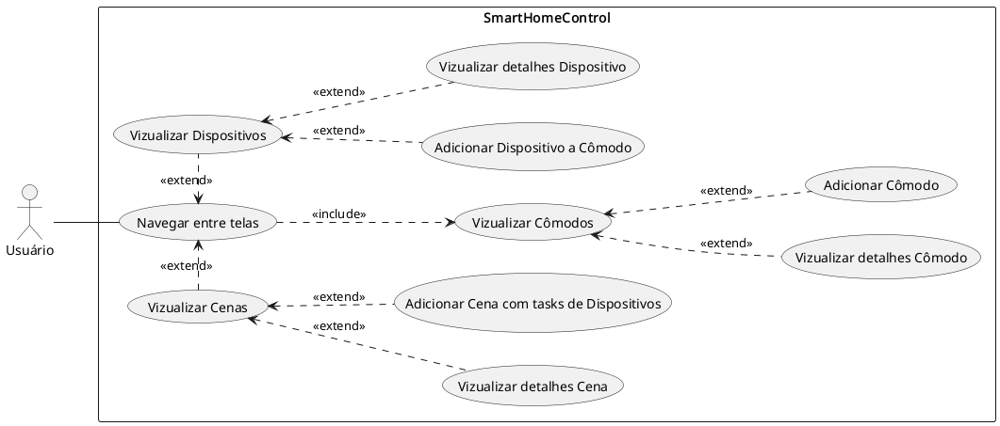
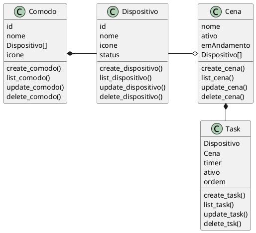
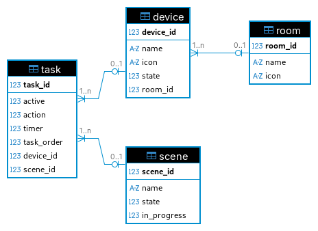

# Smart Home Control

Uma aplicação web de domótica que simula o controle de dispositivos de uma casa inteligente.

## Artefatos

- [Caso de Uso](#caso-de-uso)
- [Diagrama de Caso de Uso](#diagrama-de-caso-de-uso)
- [Diagrama de Classes](#diagrama-de-classes)
- [Diagrama de Entidade e Relacionamento (DER)](#diagrama-de-entidade-e-relacionamento-der)
- [Documentação de API (Endpoints)](#documentação-de-api-endpoints)
- [Mapa de Habilidades](#mapa-de-habilidades)

### Caso de Uso

- O usuário deve ser capaz de vizualizar a tela de Cômodos.
- O usuário deve ser capaz de vizualizar a tela de Dispositivos.
- O usuário deve ser capaz de vizualizar a tela de Cenas.
- O usuário deve ser capaz de vizualizar a tela de detalhes de um Cômodo.
- O usuário deve ser capaz de vizualizar a tela de detalhes de um Dispositivo.
- O usuário deve ser capaz de vizualizar a tela de detalhes de uma Cena.
- O usuário deve ser capaz de navegar entre as telas.
- O usuário deve ser capaz de adicionar novos Cômodos.
- O usuário deve ser capaz de adicionar novos Dispositivos a um Cômodo.
- O usuário deve ser capaz de adicionar novas Cenas com tasks para Dispositivos.

[Artefatos](#artefatos)

### Diagrama de Caso de Uso

[Artefatos](#artefatos)

### Diagrama de Classes

[Artefatos](#artefatos)

### Diagrama de Entidade e Relacionamento (DER)

[Artefatos](#artefatos)

### Documentação de API (Endpoints)

1. Cômodos (Rooms)
    - Listar todos os cômodos
    - Criar um novo cômodo
    - Obter detalhes de um cômodo
    - Atualizar um cômodo
    - Deletar um cômodo
1. Dispositivos (Devices)
    - Listar todos os dispositivos
    - Criar um novo dispositivo
    - Obter detalhes de um dispositivo
    - Atualizar um dispositivo
    - Deletar um dispositivo
1. Cenas (Scenes)
    - Listar todas as cenas
    - Criar uma nova cena
    - Obter detalhes de uma cena
    - Atualizar uma cena
    - Deletar uma cena
1. Tarefas (Tasks)
    - Listar todas as tarefas de uma cena
    - Criar uma nova tarefa em uma cena
    - Reordenar tarefas de uma cena
    - Obter detalhes de uma tarefa
    - Atualizar uma tarefa
    - Deletar uma tarefa

[Artefatos](#artefatos)

### Mapa de Habilidades

| Integrante | Engenharia de Software | Back end | Front end | Organização |
| --- | --- | --- | --- | --- |
| Gisele | | | | |
| Hélio | Bom domínio | A dominar | A dominar | A dominar |
| Thalysson | | | | |

[Artefatos](#artefatos)
