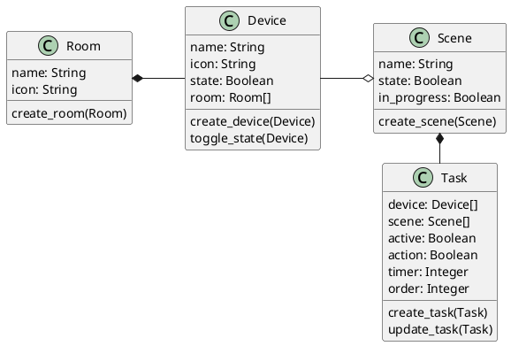

# Smart Home Control

Uma aplicação web de domótica que simula o controle de dispositivos de uma casa inteligente.

## Artefatos

- [Caso de Uso](#caso-de-uso)
- [Diagrama de Caso de Uso](#diagrama-de-caso-de-uso)
- [Diagrama de Classes](#diagrama-de-classes)
- [Diagrama de Entidade e Relacionamento (DER)](#diagrama-de-entidade-e-relacionamento-der)
- [Documentação de API (Endpoints)](#documentação-de-api-endpoints)

### Caso de Uso

- O usuário deve ser capaz de vizualizar a tela de Cômodos.
- O usuário deve ser capaz de vizualizar a tela de Dispositivos.
- O usuário deve ser capaz de vizualizar a tela de Cenas.
- O usuário deve ser capaz de vizualizar a tela de detalhes de um Cômodo.
- O usuário deve ser capaz de vizualizar a tela de detalhes de um Dispositivo.
- O usuário deve ser capaz de vizualizar a tela de detalhes de uma Cena.
- O usuário deve ser capaz de navegar entre as telas.
- O usuário deve ser capaz de adicionar novos Cômodos.
- O usuário deve ser capaz de adicionar novos Dispositivos a um Cômodo.
- O usuário deve ser capaz de adicionar novas Cenas com tasks para Dispositivos.

### Diagrama de Caso de Uso

### Diagrama de Classes

### Diagrama de Entidade e Relacionamento (DER)

### Documentação de API (Endpoints)

TODO
